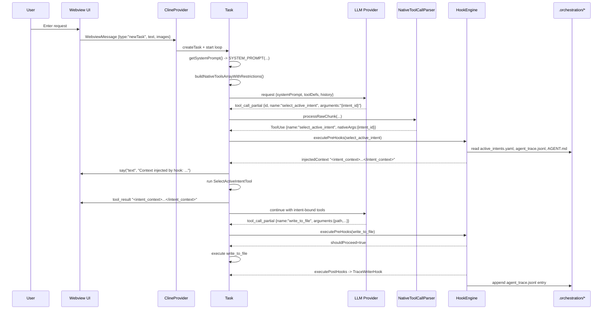
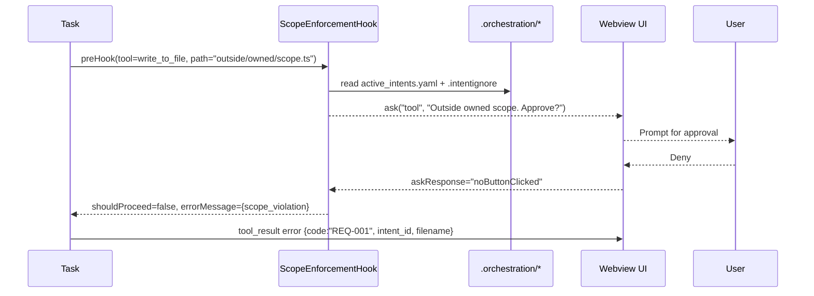
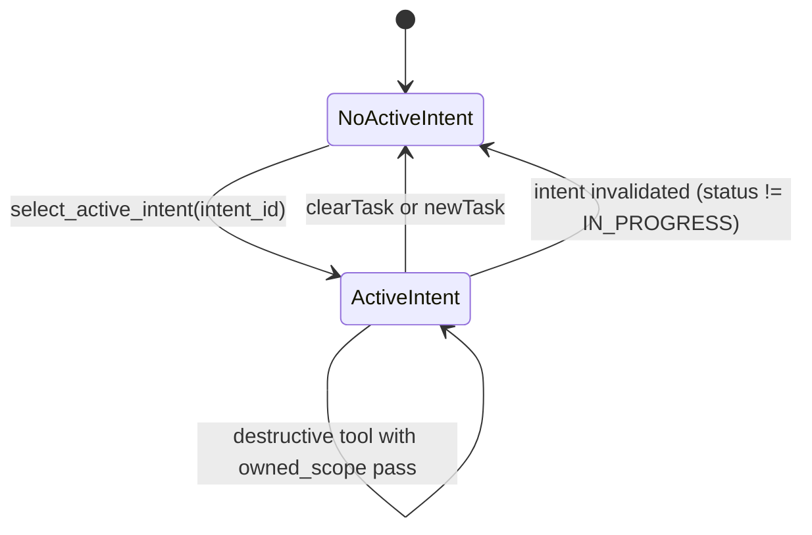

# Architectural Overview of Roo Code (Intent-Driven Host Extension)

This document traces the real execution path in the codebase, maps data boundaries, and pinpoints the hook injection chokepoint. It also specifies the reasoning-loop architecture for intent-driven context injection and provides implementable diagrams.

## Purpose and How the Extension Works

**Purpose**

Roo Code is a VS Code extension that embeds an AI agent into the editor to assist with coding tasks (generation, refactoring, debugging, and automation). It extends the editor with a webview chat UI and an extension-host orchestration layer that constructs prompts, streams model output, executes tools against the workspace, and enforces intent-driven boundaries.

**How It Works (High-Level)**

1. A webview React UI captures user requests and sends structured `WebviewMessage` objects to the extension host.
2. The extension host (`ClineProvider` + `Task`) builds the system prompt and tool definitions, then calls the configured model provider with the current conversation history.
3. Model output streams back as incremental chunks; tool calls are parsed and dispatched by `presentAssistantMessage`.
4. Tools perform reads/writes/commands via extension-side handlers. Results are appended to the conversation as `tool_result` blocks and pushed to the webview.
5. An intent handshake (`select_active_intent`) gates destructive actions and injects scoped context from `.orchestration`, while hooks enforce scope and trace edits.

## Host Extension Architectural Analysis (Phase 0)

**Activation and State Hydration (pre-turn context)**

1. Extension activation in `src/extension.ts` creates the `ContextProxy` (settings/state store) and instantiates `ClineProvider`, which is the webview view provider and task orchestrator.
2. When the webview loads, it emits `webviewDidLaunch` via `vscode.postMessage`. `webviewMessageHandler` handles this by posting the full extension state, theme, MCP server list, and API configuration metadata back to the UI.
3. The UI hydrates in `webview-ui/src/context/ExtensionStateContext.tsx` via `window.addEventListener("message", ...)`, merging incoming `state` updates into React state. This is the UI side of the message boundary.

**Trace of Execution: Single Agent Turn (detailed path)**

1. The user submits a chat prompt in the webview. The UI emits a typed `WebviewMessage` using `vscode.postMessage` (`webview-ui/src/utils/vscode.ts`), typically `{ type: "newTask", text, images }`.
2. The extension host receives the message via `ClineProvider.setWebviewMessageListener` in `src/core/webview/ClineProvider.ts`, which wires `webview.onDidReceiveMessage` to `webviewMessageHandler`.
3. `webviewMessageHandler` switches on `message.type`. For `newTask`, it calls `provider.createTask(...)`, which constructs a `Task` in `src/core/task/Task.ts` and starts execution (`startTask`).
4. `Task.startTask` calls `initiateTaskLoop`, which builds `userMessageContent` and enters `recursivelyMakeClineRequests`. This loop is the per-turn driver.
5. Each request in `recursivelyMakeClineRequests` calls `attemptApiRequest`, which gathers runtime state from the provider, applies rate-limit waits, and computes context management decisions.
6. `attemptApiRequest` builds the system prompt by calling `getSystemPrompt` -> `SYSTEM_PROMPT` in `src/core/prompts/system.ts`. This is stateless and reassembled every turn from `ContextProxy` and runtime settings.
7. Tool schemas are assembled by `buildNativeToolsArrayWithRestrictions` in `src/core/task/build-tools.ts`. It merges native tools, MCP tools, and custom tools, applies mode filters, and may return `allowedFunctionNames` for providers that require it.
8. If context thresholds are exceeded, `attemptApiRequest` runs context management (`manageContext`) and may condense history. This path includes its own tool metadata and environment details to avoid tool-call incompatibilities.
9. The API handler streams back `ApiStreamChunk` objects (see `src/api/transform/stream.ts`). Tool calls arrive as `tool_call_partial` or `tool_call` chunks.
10. `NativeToolCallParser` in `src/core/assistant-message/NativeToolCallParser.ts` converts raw tool chunks into `ToolUse` objects with `nativeArgs`, handling partial JSON assembly and MCP tool naming normalization.
11. Tool uses are appended to `Task.assistantMessageContent`. `presentAssistantMessage` consumes this list sequentially, guarded by `presentAssistantMessageLocked` to avoid concurrent tool execution.
12. For tool approvals, `Task.ask` writes an `ask` `ClineMessage`, posts state to the webview, and blocks until `askResponse` is received. The response flows back through `webviewMessageHandler` to `Task.handleWebviewAskResponse`.
13. Tool handlers in `src/core/tools/*` execute and push `tool_result` blocks into `Task.userMessageContent` using `pushToolResultToUserContent`. Errors and denials are serialized into structured tool_result payloads.
14. When the stream ends, `Task` saves the assistant message (including `tool_use` blocks) to `apiConversationHistory` before flushing any tool results. This ordering is enforced by `assistantMessageSavedToHistory` and `flushPendingToolResultsToHistory` to prevent orphaned tool_result IDs.
15. The loop continues with the newly built user message. If no tools were used, the task forces a corrective prompt using `formatResponse.noToolsUsed()`.

**Data Boundaries and Message Contracts**

- Webview to Extension Host. The boundary is `vscode.postMessage` in the webview and `webview.onDidReceiveMessage` in the extension. Messages conform to `WebviewMessage` types in `@roo-code/types` and are dispatched by `src/core/webview/webviewMessageHandler.ts` (examples: `newTask`, `askResponse`, `updateSettings`).
- Extension Host to Webview. `ClineProvider.postMessageToWebview` sends messages consumed by `window.addEventListener("message", ...)` in `webview-ui/src/context/ExtensionStateContext.tsx` and component-level listeners, including `state`, `theme`, and `mcpServers`.
- Extension Host to LLM Provider. `Task` builds a native tool-calling request composed of `apiConversationHistory` (API messages), a freshly assembled system prompt string, and tool definitions from `buildNativeToolsArrayWithRestrictions`.
- Settings boundary. UI settings changes are sent via `updateSettings`, and `webviewMessageHandler` persists them through `ContextProxy` (global/workspace state). These values are then re-read for subsequent prompt/tool assembly.

**Internal Data Model and Persistence**

- UI history uses `ClineMessage` objects (chat rows, asks, checkpoints). This is separate from `apiConversationHistory`, which stores the provider-facing `ApiMessage` list.
- `saveTaskMessages` persists UI messages and metadata; `MessageManager` provides rewind and edit workflows (used by delete/edit flows in `webviewMessageHandler`).

**Architectural Constraints That Shape the Design**

- System prompts are rebuilt on every request, not cached, so any prompt-level hook must be injected at runtime in the tool loop rather than as a one-time prompt mutation.
- Tool call streams can be partial. `NativeToolCallParser` must buffer and merge JSON fragments into `nativeArgs`, so the tool loop must tolerate partial tool_use blocks.
- Tool_result blocks must follow their tool_use counterparts. `Task` enforces this by saving assistant messages before executing tools and by deduplicating tool_use IDs.
- `new_task` is isolated: if it appears with other tools in a single assistant message, `Task` truncates subsequent tool uses and injects tool_result errors for the skipped tools.
- Context management can rewrite history when thresholds are exceeded, so any injected context must be compact and resilient to truncation.

**Precise Hook Injection Chokepoint**

- The exact chokepoint is the tool execution switch in `presentAssistantMessage` (`src/core/assistant-message/presentAssistantMessage.ts`), where each `ToolUse` is dispatched.
- `executeToolWithHooks` is defined there and currently wraps `select_active_intent` and `write_to_file`. Other tool cases call handlers directly, so this switch is the precise location to insert or extend hooks for full destructive-tool coverage.
- The hook engine is instantiated per `presentAssistantMessage` call and can inject context via `cline.say` before tool execution, or block the tool by returning `shouldProceed=false` in `PreHookResult`.

## Reasoning Loop Architecture (Phases 1 and 2)

**Two-Stage Handshake**

Stage 0: No Active Intent. The only valid next action is `select_active_intent`. The requirement is enforced by the system prompt in `src/core/prompts/sections/tool-use-guidelines.ts` and the tool definition in `src/core/prompts/tools/native-tools/select_active_intent.ts`.

Stage 1: Active Intent Selected. Destructive tools are allowed only when scope checks pass, enforced by `ScopeEnforcementHook`.

**Handshake Trigger Tool**

- Tool. `select_active_intent` in `src/core/tools/SelectActiveIntentTool.ts`.
- Trigger input. `{ intent_id: "INT-xxx" }` from `.orchestration/active_intents.yaml`.
- Output. `<intent_context> ... </intent_context>` XML describing intent specification, owned_scope, constraints, acceptance_criteria, and related traces.

**Gatekeeper and Scope Enforcement**

- `ContextInjectorHook` in `src/hooks/ContextInjectorHook.ts` intercepts `select_active_intent` before execution, reads `.orchestration/active_intents.yaml`, `.orchestration/agent_trace.jsonl`, and `.orchestration/AGENT.md`, then injects an `<intent_context>` block and records `task.activeIntent`.
- `ScopeEnforcementHook` in `src/hooks/ScopeEnforcementHook.ts` blocks destructive tools if no active intent exists, checks `.orchestration/.intentignore` for bypass, validates paths against `owned_scope`, and asks the user for approval on violations or unknown targets.
- Tool classification is centralized in `src/hooks/ToolClassifier.ts`, defining the destructive tool set.

**Post-Execution Traceability**

- `TraceWriterHook` in `src/hooks/TraceWriterHook.ts` appends entries to `.orchestration/agent_trace.jsonl` after mutating tools run, capturing intent_id, tool name, and file hashes.

**Failure Modes and Recovery Paths**

- Intent not found or not `IN_PROGRESS`. The `select_active_intent` tool and `ContextInjectorHook` reject the call with a structured error. Recovery is to update `.orchestration/active_intents.yaml` or choose a valid intent ID.
- Scope violation. `ScopeEnforcementHook` asks for HITL approval. If denied, it returns a `tool_result` error with `scope_violation` metadata.
- Unknown targets. When a destructive tool does not declare paths, the hook asks the user. Approval is required to proceed.
- Context window exceeded. `Task.handleContextWindowExceededError` condenses the conversation, so injected context must be compact and resilient to truncation.

**Theoretical Grounding (Cognitive Debt and Trust Debt)**

- Cognitive debt is reduced by forcing the agent to externalize intent selection, preventing hidden assumptions and requiring explicit scope and constraints.
- Trust debt is repaid through scope enforcement, HITL approvals, and trace logging, creating a verifiable audit trail tied to intent IDs.

## Visual System Blueprint (Diagrams)

